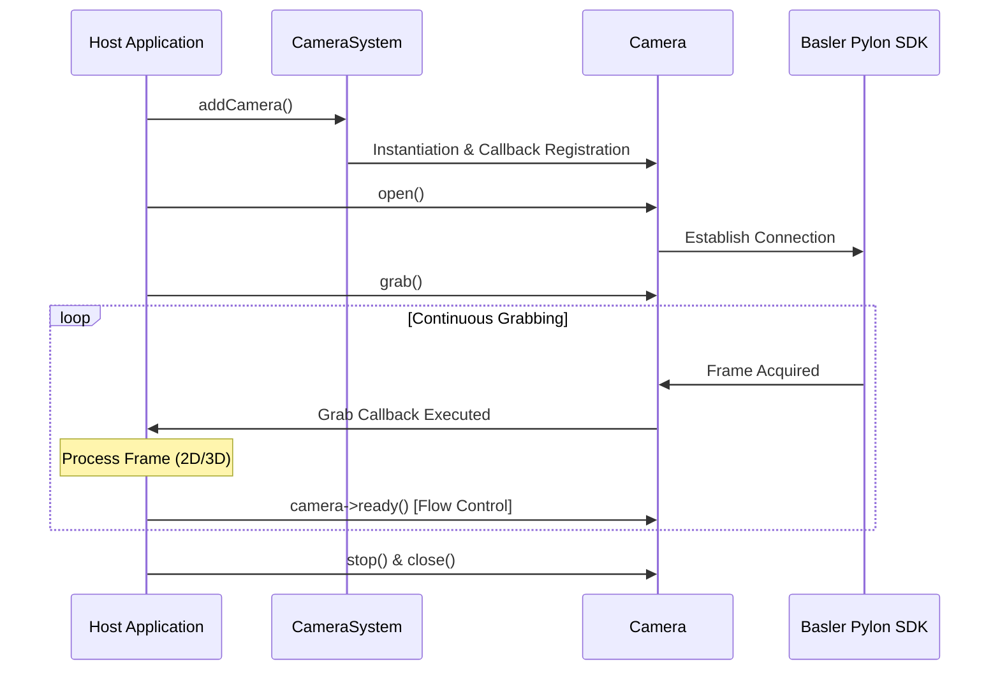

# 📷 Camera Module

[](https://en.cppreference.com/w/cpp/compiler_support)
[](#)
[](https://www.baslerweb.com/)
[](https://www.qt.io/)

Basler pylon 카메라를 C++ 환경에서 고속으로 제어하고, 실시간 이미지를 수신하기 위한 경량 고성능 이미지 취득(Acquisition) 라이브러리 모듈입니다.

---

## 🚀 Key Features

* **강력한 카메라 생명주기 관리**: Basler Pylon SDK를 래핑하여 장치 검색, 연결 수립, Single/Continuous Grabbing을 안전하게 핸들링합니다.
* **3D 멀티파트 스트림 지원**: Pylon 3D 데이터 수신을 위한 Grab 콜백 인터페이스를 제공하여 2D 이미지와 3D 포인트 클라우드 데이터를 동시에 처리할 수 있습니다.
* **고속 Qt 통합 위젯**: 장치 탐색, 연결 및 실시간 파라미터 튜닝이 가능한 `QCameraWidget`과 Pylon 버퍼를 `QImage`로 고속 복사하는 `QtConverter`를 기본 내장하고 있습니다.
* **독립적 로깅 프레임워크**: `CameraSystem::syslog()`를 통해 Qt 로깅 엔진에 커플링되지 않는 표준 스트림 기반 로깅을 제공하여 호스트에서 가볍게 리다이렉트할 수 있습니다.

---

## 📦 System Architecture

카메라 수명주기와 취득 루프의 간결한 흐름도입니다.



---

## 🛠️ Requirements & Dependencies

| Requirement | Description |
| :--- | :--- |
| **OS Support** | macOS 12+ / Windows 10+ |
| **C++ Standard** | C++17 이상 필수 (C++20 권장) |
| **Pylon SDK** | Basler Pylon SDK 설치 및 `PYLON_ROOT` / `PYLON_DEV_DIR` 설정 필요 |
| **Qt Framework** | Qt 5.15+ 또는 Qt 6.x (Core, Gui, Widgets, Xml) *[선택 사항, UI 활성 시]* |

---

## 💻 Quick Start

### 1. CMake Integration
상위 프로젝트 CMakeLists.txt에서 서브디렉토리로 등록한 후 타겟 링크합니다.

```cmake
# Add module target
add_subdirectory(modules/Camera/C++)

# Link to host target
target_link_libraries(YourHostApp PRIVATE Camera)
```

### 2. Basic Example
```cpp
#include "CameraSystem.h"
#include <iostream>

int main()
{
    CameraSystem system;
    Camera* camera = system.addCamera();

    if (!camera->open()) {
        std::cerr << "Failed to open Basler Camera" << std::endl;
        return 1;
    }

    // 2D 이미지 Grab 콜백 등록
    camera->registerGrabCallback([](const Pylon::CPylonImage& image, size_t frameNo) {
        std::cout << "Acquired Frame: " << frameNo << std::endl;
        
        // 중요: 처리가 완료되면 다음 프레임을 수신할 수 있도록 ready 신호를 보냅니다.
        camera->ready();
    });

    // Grabbing 시작
    camera->grab();

    // ... 비동기 처리 대기 ...

    // 해제 시
    camera->stop();
    camera->close();
}
```

---

## ⚠️ Development Notes

> [!IMPORTANT]
> **백프레셔 및 흐름 제어 (`ready()`)**
> 실시간 고속 Grabbing 시 호스트 GUI의 지연이 이미지 수신 버퍼 큐 오버플로우를 발생시키지 않도록 백프레셔 제어를 적용하고 있습니다. Grab 콜백 완료 시 반드시 `camera->ready()`를 명시적으로 호출해야 다음 프레임이 인큐됩니다.

> [!WARNING]
> **스레드 안전성 및 GUI 업데이트**
> Grab 콜백은 Pylon SDK가 스폰한 독립 백그라운드 스레드에서 다이렉트로 실행됩니다. 콜백 내부에서 Qt GUI 요소나 위젯을 직접 수정할 경우 크래시가 발생하므로, 반드시 `QMetaObject::invokeMethod`를 사용하여 GUI 스레드로 신호를 전달해야 합니다.

> [!CAUTION]
> **자원 해제 수명주기**
> 애플리케이션 종료 시 `CameraSystem`이 파괴되기 전에 등록된 UI 콜백을 먼저 해제하고 `CameraSystem::removeCamera()`를 통해 카메라 자원을 완전 회수해야 합니다. 호스트는 윈도우 파괴자(destructor) 내에서 순차 소멸 흐름을 준수해야 합니다.
